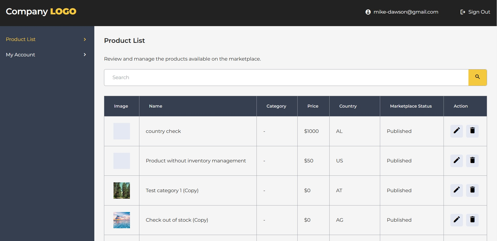

# Test Table

## Description

This project is a product table built with Vite, React, and TypeScript. Modular CSS styles with SCSS are used for styling. Data is fetched using Redux Toolkit, ensuring a single source of truth. The project includes:

- Filtering by product name
- Pagination
- Selection of the number of displayed products per page

## Technologies that have been used

- HTML5
- CSS3
- SCSS
- JAVASCRIPT (ES6+)
- TYPESCRIPT
- REACT
- GIT
- VITE
- REDUX TOOLKIT

## Instructions for working with the project

1. Cloning a repository. You need to write `git clone https://github.com/boikoua/test_table` in terminal.

2. Go to the project folder `cd test_table`.

3. Check the node version. The version of node should be `v20.x.x`. To do this, type the command `node -v` in the terminal.

4. Install dependencies. To do this, enter the `npm install` command.

5. Run the project. To do this, enter the `npm run dev` command.
   After that the project will be available to you at `http://http://localhost:5173/`.

## View project

> Link to the project
> [DEMO LINK](https://boikoua.github.io/test_table/).

> Link to website layout in Figma
> [Test Table](https://www.figma.com/design/QVv3GewLwqYz9Y1BcUiYmd/test-task?node-id=1-305&t=BaINiNvFc148FgpP-1)

## Preview

